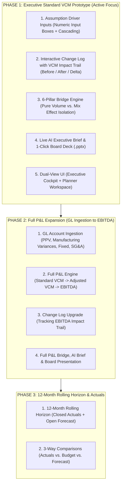

# 🗺️ Project Roadmap & Architecture Blueprint

**Application:** Chemical FP&A Financial Planner  
**Business Domain:** Chemical Manufacturing (9 Products across 3 Product Lines)  
**Primary Horizon:** 12-Month Rolling Horizon (Calendar Year 2026 baseline)  

---

## 🎯 Executive Vision & Domain Context

The **Financial Planner** is a corporate Financial Planning & Analysis (FP&A) tool built specifically for a chemical manufacturing enterprise.

* **Portfolio Structure:**
  * **9 Products** divided across **3 Product Lines**.
  * **Line 1 (Performance Specialties):** High margin (~45-55% VCM), specialty applications, formula-based pricing.
  * **Line 2 (Functional Formulations):** High margin (~35-45% VCM), value-add chemical solutions.
  * **Line 3 (Base Intermediates):** Lower margin (~15-22% VCM), high feedstock volume scale.
  * **Volume Distribution:** Similar volume scale across lines (~33% share each), making portfolio **Mix Shift** a critical financial driver.
* **Core Philosophy:**
  * **Single Source of Truth (Atomic Grain):** All top-down macro assumptions cascade directly down to the atomic grain (`[Period] × [Plant] × [Customer] × [Material]`). Bottom-up rollups and granular customer lines always reconcile perfectly.
  * **Strict Decimal Precision:** No binary floating-point (`float`). All volume, price, currency, and margin calculations enforce standard Python `decimal.Decimal`.
  * **Dual-View Architecture:** An **Executive Cockpit** for C-suite what-if analysis and a **Planner Workspace** for FP&A controllers.
  * **Auditable Financial Impact Log:** Every assumption shift logs the before/after metrics, dollar delta, and percentage impact on VCM/EBITDA.

---

## 🏗️ The 3-Phase Strategic Roadmap



---

## 🏆 Phase 1: Executive Standard VCM Prototype (Current Focus)

*Goal: Deliver an interactive C-level prototype to secure executive sponsorship within a 5-minute demo.*

### 1. Assumption Driver Input Boxes & Top-Down Cascading
* **Clean Numeric Input Boxes:** Dedicated input fields (avoiding imprecise sliders) for fast scenario adjustments:
  * **Volume:** `[ ± % ]` targeted by Product Line, Material, Customer, or Total Portfolio.
  * **Prices:** `[ ± % ]` or `[ ± $/MT ]` targeted by Product Line or Material.
  * **Raw Material Costs:** `[ ± % ]` index adjustment per material/feedstock.
  * **Variable Non-Raw Costs:** `[ ± % ]` or `[ ± $/MT ]`.
  * **Distribution Costs:** `[ ± % ]` or `[ ± $/MT ]`.
  * **FX Rates:** Direct exchange rate inputs (e.g., `[ 1.08 ]` EUR/USD, `[ 5.25 ]` USD/BRL).
* **Atomic Disaggregation:** All top-down inputs cascade down to the lowest level of granularity (`[Period] × [Plant] × [Customer] × [Material]`).

### 2. Scenario Change Log with Financial Impact Trail
* Every assumption change records an auditable entry into the scenario's metadata:
  * Timestamp & Author/User
  * Driver & Scope (e.g., "Price +5.0% on Product Line 1")
  * Metric Before ($ VCM) vs Metric After ($ VCM)
  * Net Impact ($\Delta$ VCM $ and $\Delta$ VCM %)
* Displayed as an executive timeline in the Cockpit and as a detailed audit grid in the Planner Workspace.

### 3. Advanced 6-Pillar Bridge Engine (Volume vs. Mix Isolation)
* Upgrade `src/financial_planner/calculations/bridge.py` to isolate the **Mix Effect**:
  1. **Baseline VCM**
  2. **Pure Volume Effect:** $(\Delta \text{Total Volume}) \times \text{Baseline Portfolio Unit Margin}$
  3. **Mix Effect:** Portfolio shift across the 3 product lines (rewarding Line 1/2 growth over Line 3)
  4. **Price Realization:** Realized pricing changes
  5. **Cost Effect:** Raw Material + Variable Non-Raw + Distribution cost changes
  6. **FX Effect:** Currency translation impact
  7. **Simulated VCM**
* Includes interactive click-to-drilldown on the **Mix bar** to inspect product-level contributions.

### 4. AI Executive Brief & 1-Click Board PPTX
* **AI CFO Brief:** Context-aware 3-bullet executive narrative highlighting Mix and Price vs. Cost dynamics.
* **1-Click Board Slide:** High-contrast, executive-ready PowerPoint export (`.pptx`) containing the waterfall chart and executive commentary.

### 5. Dual-View UI Reorganization
* **Executive Cockpit (Flight Simulator):** Macro/commercial driver input boxes, real-time reactive waterfall, Change Log timeline, and AI brief.
* **Planner Workspace:** High-density data tables (Volumes by Customer/Material, Price lists, Cost tables), raw file uploads, and granular diffing.

---

## 🏭 Phase 2: Full P&L Expansion (Variances to EBITDA)

*Goal: Expand from Standard VCM to complete Operating Income (EBITDA) using standard GL trial balance data.*

```text
Gross Sales Revenue (Volume × Standard Price)
(-) Off-invoice Discounts & Rebates
(=) Net Sales Revenue
(-) Standard Raw Material Costs (BOM)
(-) Standard Variable Non-Raw (Energy, Catalysts, Packaging)
(-) Standard Primary Distribution & Freight
(=) Standard VCM (Variable Contribution Margin)
    (-) Raw Material PPV & Inventory Revaluations [GL 5100xx]
    (-) Energy & Catalyst Manufacturing Variances [GL 5200xx]
    (-) Distribution & Freight Surcharges [GL 5300xx]
(=) Adjusted / Actual VCM
    (-) Plant Fixed Direct Labor [GL 6100xx]
    (-) Plant Maintenance & Site Services [GL 6200xx]
    (-) Plant Depreciation & Operational Amortization [GL 6300xx]
(=) Gross Profit
    (-) Supply Chain & Logistics Overhead [GL 7100xx]
    (-) Sales, Marketing & Technical Services [GL 7200xx]
    (-) Corporate G&A & Shared Services [GL 7300xx]
(=) EBITDA
```

* **GL Account Ingestion:** Load monthly GL account balances for variances, plant fixed costs, and SG&A.
* **Full P&L Bridge & Commentary:** Extend the bridge and AI commentary to explain below-VCM variances and overhead absorption.
* **EBITDA Impact Tracking:** Update the Change Log to track both $\Delta$ VCM and $\Delta$ EBITDA for every scenario adjustment.

---

## 🔄 Phase 3: 12-Month Rolling Horizon & Actuals

*Goal: Support continuous rolling forecast cycles with automated actuals reconciliation.*

* **12-Month Rolling Horizon:** Support dynamic rolling windows where closed months are loaded as Actuals and future months as Forecast.
* **3-Way Comparisons & Waterfall Bridges:**
  * *Actuals vs. Budget*
  * *Actuals vs. Latest Forecast*
  * *Latest Forecast vs. Budget*
* **SAC Export Driver:** Export finalized forecast scenarios into dimensional schemas ready for SAP Analytics Cloud.

---

## ⚠️ Core Engineering Constraints & Guidelines

1. **Decimal Math Only:** Never use binary `float` for currency, pricing, unit costs, or volumes. Always use Python's `decimal.Decimal`.
2. **Zero-Volume Robustness:** Zero-volume planning rows are valid business signals and must never cause divide-by-zero errors.
3. **Single Container Deployment:** Packaged for Google Cloud Run on a single port (FastAPI serving compiled React static assets + REST APIs).
4. **Test-Driven:** Maintain 100% passing pytest suites (`python -m pytest`) for all calculation modules and API endpoints.
